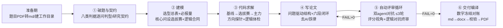

# 国赛作战包（guosai-zuozhanbao）

> 数学建模国赛（CUMCM）**C 题 AI 协同作战 SOP 技能包**。
> 把"破题 → 建模 → 求解 → 写作 → 评审 → 交付"固化成一条 agent 流水线：主 agent 只做调度，子 agent 按阶段提示词干活，阶段之间靠磁盘文件交接——**换窗口不丢进度，赛时零临场发挥**。


---

## 这是什么

一套经过 **3 届真题全流程模拟（2023C / 2024C / 2025C）迭代打磨**的数学建模竞赛作战体系。它不是一个程序，而是一套 **"SOP 文档 + 阶段提示词模板 + 可执行脚本 + 知识资产"** 的组合，可以让任何能力足够的 LLM agent（ZCode / Claude Code / Cursor 等）按图索骥地打完一场国赛。

设计目标只有一句话：**以后做建模/写国赛论文，照这个流程跑，负担最轻。**

### 核心理念（从实战事故里长出来的）

1. **先契约后动手**——研究契约 + Claims-Evidence 矩阵锁范围，防跑偏、防上下文污染
2. **数字可追溯**——正文每个数字必须能在 `all_results.json` 找到键；定稿冻结、编译前零漂移对账
3. **让另一个模型审上一个模型**——评审者与改稿者必须是不同的子 agent，≤3 轮循环
4. **主 agent 只调度，不干活**——子 agent 并行拉满，阶段产物文件级验收，30~60 分钟巡检节拍
5. **单 agent 兜底**——比赛环境不支持子 agent 时，每阶段把中间结论压缩写盘，断点可恢复

## 总体流水线



- **改进论文模式**（特殊模式）：输入往年优秀论文 → 找不足 → 产出带「修改总概况」的改进稿，练手专用，不进正式赛。

## 目录结构

```
guosai-zuozhanbao/
├── SKILL.md                     # 技能入口：资产索引 + 子agent流水线执行方式
├── stages/                      # ★ 7 个阶段的子agent提示词模板（核心引擎，填占位符即用）
│   ├── stage1_破题与契约.md      # 40分钟破题流程、题面事实清单、选型总表
│   ├── stage2_建模.md            # 选型口径、必报量、bake-off任务书、逻辑合同
│   ├── stage3_代码求解.md        # 七类质量门、题型专项纪律、选拔赛执行、求解纪律
│   ├── stage4_写论文.md          # 问题驱动结构、六段闭环、页数预算、摘要范式
│   ├── stage5_自动评审循环.md     # 评审者/改稿者双agent、10条重点核查、门禁定级
│   ├── stage6_交付编译.md         # 数字冻结对账、格式校验、AI合规三件套、脱敏
│   └── stage7_赛后复盘.md        # 复盘三问、三通道回流（作战包的成长史=git log）
├── references/                  # ★ 30+ 份编号资料库（00 总入口先读）
│   ├── 00_作战SOP.md            # 总入口：全流程 + 改进论文模式 + 历次升级记录
│   ├── 21_赛题识别八类任务判据.md # 破题/选型圣经：八类任务判据+必报量+高频误配
│   ├── 22_题型流程化解题手册.md   # 七类题型作业流程+必做检验速查+不推荐清单
│   ├── 20_雷点库 / 24_数字诚实性 # 实战 FAIL/WARN 沉淀（语言版式类 / 数字逻辑类）
│   ├── 25_流程图SOP / 26_图表模式库 / 28_获奖卷图式库  # 作图三件套
│   ├── 27_模拟复盘_事故库与提速SOP # 事故库 + 巡检节拍 + agent 分工铁律
│   ├── 30_数模模型字典.xlsx      # ★ 5713 条模型字典原件（15 字段：假设/禁忌/检验等）
│   ├── 31_模型字典_全审标注版.xlsx # ★ 逐条全量审核标注版（可信74.9%/注水18.6%…）
│   ├── 30_模型字典使用说明与审核结论.md # 字典用法 + 全审结论 + 三处警惕
│   ├── 32_命题人评阅要点库.md    # ★ 22篇命题人官方解析+评分细则蒸馏（14条铁律+22题速查）
│   ├── 官方文件/                 # 组委会官方原件（格式规范/AI规定/Word模板），最高裁决
│   └── ...（契约/实验计划模板、去AI铁律、123条自查清单、编译提交说明等）
├── scripts/                     # ★ 可执行工具
│   ├── build_docx.py            # 论文.md → 符合国赛 Word 规范的 .docx
│   ├── validate_docx_format.py  # 程序化格式校验（fail==0 才过）
│   ├── lint_md.py               # 转换前 md 源预检
│   ├── freeze_numbers.py        # 数字冻结/对账（防"改了代码论文还是旧数"）
│   ├── logic_audit.py           # 逻辑体检闸（外推/特征/重复计量/方向四查）
│   ├── cross_problem_check.py   # 跨问结论对撞闸
│   ├── query_model_dict.py      # 模型字典检索（带审核结论过滤）
│   ├── figure_templates.py      # 数据图模板
│   └── cumcmthesis.cls 等       # LaTeX 备选路线模板
└── assets/                      # draw.io 流程图版式模板
```

## 核心机制详解

### 1. bake-off 选拔赛（选型不做拍脑袋）

核心问的求解计划必须列 2~4 个候选模型（含 1 个主流基线），用**统一验证协议**（同一切分/预处理/指标/固定种子）全部跑完，结果落 `all_results.json` 的 `bakeoff_q*` 键，按预设决策规则（主指标赢+稳定性+可解释+必报量可满足）定赢家。两条铁律：

- **验证段选模型、测试段只报告**（拿测试段挑模型 = 信息泄漏）
- **落选者一个字不进论文**——全文只按赢家方法一气呵成地写

选型口径：以题目适配 + 可解释 + 可核验为准，主流方法是低风险默认而非强制；创新只落在**结构层**（目标函数/约束/耦合机制），不落在标签层（冷门变体堆砌），全卷新颖度预算 1~2 处。

### 2. 逻辑合同（治"数值合法但逻辑错"）

建模阶段产出机器可核的 `LOGIC_CONTRACT.json`，六类元约束：

| 约束 | 治什么 |
|---|---|
| `bounds` | 反解/删失/封顶量的方向声明——必须走"不等号→代入→推界→数值验算"四步，禁拍脑袋；代码阶段用**方向探针**（输入朝真值方向推 δ 重算）数值证伪 |
| `no_double_count` | 总量拟合已吸收的分项，代码里又显式加一次 |
| `must_features` | 必须进模型的真实观测变量被漏用 |
| `train_range` | 预测点超出数据实测区间却用确定性口吻 |
| `constraints_with_margin` | "顶格达标、零安全裕度"的工程不可用解 |
| `equivalence_claims` | 声称"A 退化为/等价于 B"却数值对不上 |

多问题题另配 `CROSS_PROBLEM_LEDGER.json`：上游问的关键结论（峰值/边界）显式约束下游问，防"Q1 算出超限、Q2 优化却只压稳态"式跨问矛盾。配套两个确定性闸脚本（`logic_audit.py` / `cross_problem_check.py`）：退出码 0=过、1=确凿逻辑错必修、2=无据可查软跳过。

### 3. 三层评审防线

| 层 | 手段 | 抓什么 |
|---|---|---|
| ③ 确定性闸 | 逻辑体检四查（外推/特征/重复计量/方向）+ 跨问对撞 | 机器可判的硬伤，零 AI 额度 |
| ⑤ 独立视角对抗复核 | 评审 agent ≠ 写作 agent，六类清单逐条对撞 | 自查看不见的语义盲区 |
| ⑤ 评分视角终审 | 按命题人评分骨架逐问核对 | "能不能得分"而非"对不对" |

### 4. 数字诚实性

正文数字必须先落盘（`all_results.json`）再引用；定稿 `freeze_numbers.py freeze` 冻结，编译前 `check` 零漂移才许编译；评审随机抽 5 个正文数字查落盘、方法表述与代码逐行比对。

### 5. 模型字典（可选加速器）

`30/31 号`收录 5713 条模型 × 15 字段（适用场景/数据要求/关键假设/**禁忌点/缺陷/检验方法**），已经**全量人工级审核**（可信 74.9% / 注水 18.6% / 存疑 5.8% / 错误 0.5% / 未核验 0.2%），每条带审核结论与备注。检索一律走脚本：

```bash
python scripts/query_model_dict.py 熵权法 --only-ok      # 完整条目，只要可信级
python scripts/query_model_dict.py "GM(1,1)" -n 3        # 全角/半角括号自动归一
python scripts/query_model_dict.py --stats               # 审核总览
```

用法规矩：选型/写假设/定检验只用「可信」条目；「错误」禁引结论；「注水」不从中选模型。字典定位是**新方法的保险丝，不是禁区**——冷门方法查过禁忌、过三问自查、赢过基线，就是差异化优势。

## 快速开始

### ZCode 用户（推荐）

```powershell
git clone https://github.com/LucyMerrill/guosai-zuozhanbao.git "$env:USERPROFILE\.zcode\skills\guosai-zuozhanbao"
```

重启会话后说 **"按作战包跑第①阶段，题是……"** 即自动触发。全流程口令：**"跑完整流程" + "继续" + "有问题直接说"**。

### 其他 AI 编程工具（Claude Code / Cursor / 任意 agent）

克隆本仓库，把 `SKILL.md` 与 `stages/stageN_*.md` 作为系统提示词/任务提示词使用：主 agent 逐阶段读取 stage 模板 → 填入 `{工作目录}` `{skill目录}` 占位符 → 派发给子 agent；无子 agent 能力时按 SKILL.md 的"单 agent 兜底模式"顺序执行。

### 比赛当天的最简路径

1. 题目 PDF 转 md（`uvx markitdown 题目.pdf -o 工作目录/题目.md`）
2. 说："按作战包跑完整流程，题是：……，数据在：……"
3. 在 4 个检查点（模型确认/评审快照/定稿/提交终检）拍板

## 合规与免责

- 本项目仅供**学习交流与竞赛研究**，请遵守所在赛事的全部规则；使用 AI 辅助参赛务必按组委会要求（如 CUMCM《AI 工具使用规定》）如实申报。
- 流程中引用的评分细则、命题人观点等均为二手整理，**以组委会官方原件为最高裁决**。
- 不构成任何"保奖承诺"；方法论效果取决于团队自身。

## License

[MIT](LICENSE)
